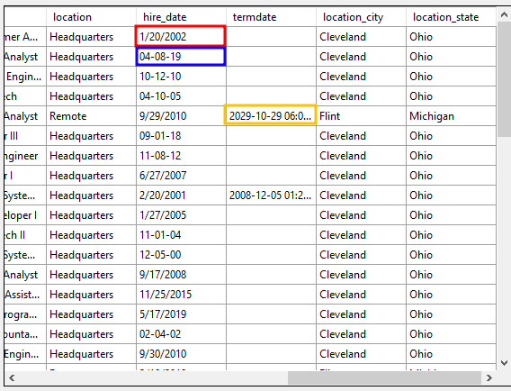

# HR Data Analysis

In this project I performed exploratory data analysis on data from human resources department, as well as cleaned and visualized the data using SQL and PowerBI


## Objectives

- Load data from .CSV file to MS SQL SERVER Database
- Clean the data using SQL Queries (data standardization, changing data types, etc. using: UPDATE, ALTER, CASE, subqueries, VIEWS)
- Perform Exploratory Data Analysis using SQL Queries
- Connect with MS SQL SERVER Database using PowerBI and create visualization


# Deployment
## Getting statistics for the channels

- Load the data into a MS SQL SERVER Database
The data was provided in a .CSV format and I needed to load it into a database. In order to do so I created a database:
```sql
CREATE DATABASE HR_project;
```

And used MS SQL SERVER "Import flat file" to load the data


- Data Cleaning
While loading my data I noticed that "hire_date" column was not standardized and "termdate" column was not in the format and type that I wanted:





I run SQL Queries to fix it

```sql
SELECT SUBSTRING(termdate, 1, CHARINDEX('U', termdate) - 1)
FROM hr_data
```

```sql
UPDATE hr_data
SET termdate = FORMAT(CONVERT(DATETIME, SUBSTRING(termdate, 1, CHARINDEX('U', termdate) - 1), 120), 'yyyy-MM-dd')
```

```sql
ALTER TABLE hr_data
ADD termdate_fix DATE;
```

```sql
UPDATE hr_data
SET termdate_fix = CASE
	WHEN termdate IS NOT NULL AND ISDATE(termdate) = 1 THEN CAST(termdate AS DATETIME)
	ELSE NULL 
	END;
```


I also created a new column called "age"
```sql
ALTER TABLE hr_data
ADD age nvarchar(50);

UPDATE hr_data
SET age = DATEDIFF(year, birthdate, GETDATE());
```

- Exploratory data analysis
```sql
-- 1) What's the age distribution in the company?
-- age distribution
SELECT 
	MIN(age) as Youngest_Employee,
	MAX(age) as Oldest_Employee
FROM hr_data;

-- age group count
SELECT age_group, count(*) as count_groups
FROM
(SELECT CASE
	WHEN age >= 22 and age <= 30 THEN '22 - 30'
	WHEN age >= 31 and age <= 50 THEN '31 - 40'
	WHEN age >= 31 and age <= 50 THEN '41 - 50'
	ELSE '50+'
	END AS age_group
FROM hr_data
WHERE termdate_fix IS NULL
) AS sub_age_groups  -- have not been terminated yet
GROUP BY age_group
ORDER BY age_group

-- age group by gender
SELECT age_group, gender, count(*) as count_groups
FROM
(SELECT gender, CASE
	WHEN age >= 22 and age <= 30 THEN '22 - 30'
	WHEN age >= 31 and age <= 50 THEN '31 - 40'
	WHEN age >= 31 and age <= 50 THEN '41 - 50'
	ELSE '50+'
	END AS age_group
FROM hr_data
WHERE termdate_fix IS NULL
) AS sub_age_groups  -- have not been terminated yet
GROUP BY age_group, gender
ORDER BY age_group, gender
```

```sql
--2) What's the gender breakdown in the company?
SELECT gender, count(*) as count_gender
FROM hr_data
WHERE termdate_fix IS NULL
GROUP BY gender
ORDER BY gender ASC;
```


## Summary

## Authors

- [@Szymon Poparda](https://www.linkedin.com/in/szymon-poparda-02b96a248/)
